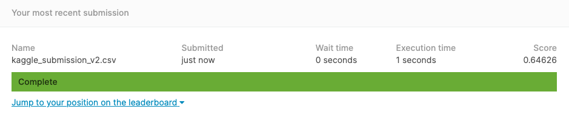

# DSI15_P4
Group 6: Stuart, Lester &amp; Marianne

### Contents:

- [1.0 Problem Statement](#1.0-Problem-Statement)
- [2.0 Executive Summary](#2.0-Executive-Summary)
- [3.0 Cost Analysis and Strategy Recommendations](#3.0-Cost-Analysis-and-Strategy-Recommendations)
- [4.0 Kaggle Submission](#4.0-Kaggle-Submission)
- [5.0 References](#5.0-References)

## 1.0 Problem Statement

1. IDEAL

We aim to produce a model which will acurately predict the probability of the West Nile Virus (WNV) being present in captured mosquitos around Chicago. From this we will be able to create a plan which is both cost effective and able to contain the virus. We will produce a cost benefit analysis to present to the Centers for Disease Control and Prevention (CDC).

Stakeholders

CDC - CDC increases the health security of America. It is Americas health protection agency, it aims to saves lives and protects people from health threats. Therfore they will be acting upon our findings. [More about CDC here.](https://www.cdc.gov/about/organization/mission.htm)

Abatement Areas - Areas responsible for paying for the local spraying services.

Citizens of Chicago - If our plan is not effective then the citizens will be the ones who suffer. They will either contract the disease or pay too much for the control process.

2. REALITY

We have been provided with data regarding Mosquito testing, pesticide spraying and the weather for the region. This has to be analysed and cleaned before we can produce a model and translate into meaningful results.

3. CONSEQUENCES

Without an accurate model then there are some serious consequences. The West Nile Virus is the leading cause of Mosquito infections in America. 

> "About 1 in 5 people who are infected develop a fever and other symptoms. About 1 out of 150 infected people develop a serious, sometimes fatal, illness." [WNV](https://www.cdc.gov/westnile/index.html)

Therefore without an accurate model the health of Chicago's citizens will be at risk as the CDC wont have the information they require to make good decisions.

4. PROPOSAL

Our proposal is to clean and explore the data and discover features that have a good correlation predicting the WNV. Success will be an accurate model that can be used to deduce key insights into how the WNV spreads. Understanding how it is effected by the weather and spraying pesticides is intergral to this. From this information we will produce a cost benefit analysis.

The algorithms we will test to see which is the most effective are Logistic regression, Random Forest and KNN.

The accuracy of our model will be based on our Kaggle Score which uses the AUC score.

## 2.0 Executive Summary

We created a model to predict the presence of West Nile Virus in a given collection of Mosquitos in Chicago. The model was tested on Kaggle and had an AUC Score of 0.646.

One really useful feature of the model is that we could infer the important drivers to enable us to create a strategic plan. Temperature, humidity, location and year are factors that were derived from the model helped underpin this approach. Lagging the weather data brought even better results and showed that the weather two weeks prior to the mosquito sample date played a role in predicting the potential for west nile virus to be present. The CDC will now have a better understanding of what they need to do to help abatement areas keep Chicago citizens safe. 

The full plan can be found below. However the most important areas are watching out for heavy rainfall in the summer months. This is because after 2 weeks a large increase in the mosquito population should be expected. If this occurs then the prevention plan can be implemented utilising citizen awareness and larvaciding. Larvaciding is effective, longer lasting and more enviromentally friendly than the alternatives. It is also the cheaper alternative in terms of cost, citizen health and the environment.

## 3.0 Cost Analysis and Strategy Recommendations

### How much of an issues is cost?

+ WNV hospitalizations cost $778 million in U.S.  1999 - 2014 [Cost of WNV](http://www.ajtmh.org/content/journals/10.4269/ajtmh.13-0206)

+ To implement an effective plan comes at a cost. In 2013 some abatement areas were declaring themselves needing increased taxes to sustain the fogging programs. Others were financial stable only if there wasnt a major outbreak.

On top of this
>the state lab that tested thousands of birds and mosquitoes to track the disease has run out of money and will not begin testing anew in the spring unless the legislature restores funding

[Chiago Tribune](https://www.chicagotribune.com/news/ct-xpm-2003-03-09-0303090283-story.html)

Chicago has 21 abatement areas. Nortwhest abatement area said it is costing them $2.17 million a year. So the cost of this 

- Emergency funds $1.8 million already handed out to help with controllling the issue.

#### So Cost is an issue. 

+ It costs a lot to treat the illness
+ It costs a lot to prevent and contain it.

#### Therefore a cost effective plan and one that achieves results is important.

---

### 1) Funding

+ Lobby for more funding for abatement areas to supplement local taxes
+ Encourage dead bird surveillance to continue to prevent it being cut due to budget. This early warning system will provide key insights.

### 2) Weather Warnings

+ Monitor temperature and rain patterns. If the temperature is rising then and there is heavy rain these can be the triggers for more active prevention methods mentioned before.
+ The weather chart shows that this is only likely in the summer months and this seasonality can help effective planning.

### 3) Prevention

Prevention is key to both control of the virus and keeping the costs low.

+ Larvaciding
+ Public Education
+ Destroy potential breeding grounds at home
+ Personal bite avoidance advice

### 4) Surveillance:

#### Mosquito Surveillance
+ Very important to see how sucessful the prevention has been and a key trigger to start Adulticiding

Type of trap - Try and use a mix
+ Cheap light traps are not the best at capturing large numbers of mosquitos but can be good to increase surveillance at low cost
+ Gravid traps are better at collecting larger numbers of mosquitos but only attract females
+ Suction traps are expensive but get good mix of mosquitos.

Dead birds
+ As cost is an issue collate the dead birds location for spatial and quantities would privide a lot of research.
+ Crows and Raptors are prone to dying from WNV a large number of reports of crow deaths would be a strong indicator of WNV presence.
+ Stopping it would be a loss of key information especially given how the WNV is transmitted.

+ Human and Equine case monitoring
    + Keeping track of actual transmission to humans is important. If the cases are rising more severe action will be needed.
    + This is more reactive and not the ideal scenario for public safety

### 5) Reactive Response

+ Aim to avoid this being necessary
+ Respond to rising levels of mosquitos and WNV cases by spraying circle of max 3 miles around test site. This is the max distance Culex mosquitos fly.
+ Human and equine cases taken into account. The more cases means that more drastic action is required.

### 6) Communication

+ Without an intergrated approach between all these steps and parties then the plan will be ineffective.
+ There needs to be coordnation between trap collectors, weather office, different abatement areas, spray companies and the citizens of Chicago.
+ They all need to play their part to save costs, contain any oubreaks and save lives.

## 4.0 Kaggle Submission

## 5.0 References

[West Nile Facts and History](https://www.palatine.il.us/501/West-Nile-Virus-Facts-History#:~:text=In%20Illinois%2C%20West%20Nile%20virus,found%20in%20the%20Chicago%20area.)

[CDC Overview of West Nile Disease](https://www.cdc.gov/westnile/index.html)

[WNV Amplifier cases](https://www.dropbox.com/s/mnvrqgeojiad8wb/Screenshot%202020-07-10%2014.00.08.png?dl=0)

[Effectiveness and economic assessment of routine larviciding for prevention of chikungunya and dengue in temperate urban settings in Europe](https://journals.plos.org/plosntds/article?id=10.1371/journal.pntd.0005918)

[CDC West Nile Virus Guidelines](https://www.cdc.gov/westnile/resources/pdfs/wnvGuidelines.pdf)

